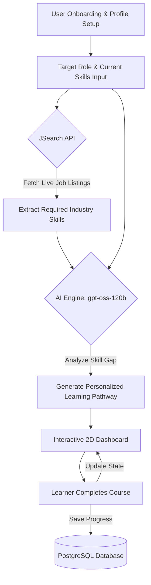

# Smart Course Suggester

**Course Name:** CEP
**Instructor Name:** Kunal Bandkar

## Team Members Details
1. **Tarun Kumar Bajotra** - 241070001
2. **Anush Tikoo** - 241070006

---

## Introduction (Background of Project)
The rapid evolution of technology and the digital economy has led to a proliferation of online learning platforms. While educational resources are more accessible than ever, learners often struggle to find clear, structured, and personalized guidance that aligns with their specific career aspirations. Generic course catalogs fail to consider a learner's existing proficiency and individual goals, making self-directed upskilling a daunting and inefficient process. Smart Course Suggester was conceived to address this challenge by leveraging artificial intelligence to create customized, adaptive learning pathways.

---

## Gap Analysis
Current e-learning platforms often rely on static curricula and broad categorization, lacking the dynamic adaptability required for modern career transitions. The primary gaps identified include:
- **Lack of Personalization:** Most platforms offer the same course recommendations regardless of a user's prior experience or exact target role.
- **Static Skill Mapping:** Industry requirements change rapidly, yet course suggestions are often based on outdated job profiles.
- **Absence of Visual Progress Tracking:** Learners lack an engaging, intuitive way to visualize their journey from their current skill level to their ultimate goal.
SmartRoute bridges these gaps by dynamically fetching real-time job market skills and using AI to map out an interactive, step-by-step pathway tailored to the individual learner.

---

## Problem Statement
In today's fast-paced tech environment, professionals and students often find it challenging to navigate the vast ocean of online courses and upskilling resources. There is a lack of personalized, dynamic guidance that takes into account an individual's current skill set, experience level, and specific career goals. Existing platforms often provide generic course lists that fail to map out a clear, step-by-step pathway from a learner's current state to mastery of their target role, leading to confusion, wasted time, and suboptimal learning outcomes.

---

## Objectives
- To develop an intelligent, AI-driven platform that curates personalized learning pathways.
- To perform automated gap analysis between a user's existing skills and the requirements of their desired role.
- To visualize the learning journey through an engaging, interactive 2D "Candy Crush"-style pathfinding dashboard.
- To streamline the user experience with a learner-centric architecture, eliminating unnecessary complexities.
- To provide high-quality course recommendations by leveraging advanced Large Language Models (LLMs).

---

## Methodology/Approach
1. **User Profiling & Context Gathering**: Collect data on the learner's current skills, experience level, and target job role during onboarding.
2. **Real-time Skill Extraction**: Utilize the JSearch API to search for live job listings of the target role and extract the exact industry-standard skills needed.
3. **AI-Driven Gap Analysis**: Utilize the OpenAI gpt-oss-120b model to analyze the user's profile against the JSearch-extracted skills to determine the precise skill gaps.
4. **Dynamic Pathway Generation**: Construct a structured sequence of courses (a "learning pathway") tailored to bridge the identified skill gaps.
5. **Interactive Visualization**: Render the generated pathway on a 2D grid visualizer (SmartRoute), allowing learners to intuitively trace their progress from the starting node to the Mastery Node.
6. **Progress Tracking**: Enable users to mark courses as completed, dynamically updating their state and moving them along the pathway.

---

## Tools / Technologies Used

### Frontend
- **React (v19)**: Component-based UI development.
- **Vite**: Ultra-fast build tool and development server.
- **Tailwind CSS (v4)**: Utility-first CSS framework for modern, responsive, and aesthetic styling.
- **React Router DOM**: Client-side routing for seamless navigation.
- **Openrouter**: Integration with Openrouter models for AI inference on the client/backend.

### Backend
- **Node.js**: JavaScript runtime environment.
- **Express.js (v5)**: Fast, unopinionated web framework for building RESTful APIs.
- **PostgreSQL (pg)**: Robust relational database for persistent data storage.
- **JWT (JSON Web Tokens) & bcrypt**: Secure user authentication and password hashing.
- **Google Auth Library**: For handling Google OAuth/SSO capabilities.
- **JSearch API**: To fetch real-time job listings and extract required skills for accurate target role profiling.

---

## System Design (Flowchart/Diagram)

---

## Key Features
- **AI-Powered Pathway Generation:** Uses advanced LLMs to build customized, step-by-step learning routes based on the user's specific skill gaps.
- **Real-Time Job Market Data:** Integrates with the JSearch API to ensure recommended skills and courses align with current industry demands.
- **Interactive 2D Visualizer:** A "Candy Crush"-style grid dashboard that provides an engaging, visual representation of the learning journey.
- **Progress Tracking:** Allows users to mark courses as completed and visually track their advancement toward the mastery node.
- **Dynamic Fallback Mechanism:** Automatically handles broken or hallucinated course links by providing a direct Google Search fallback.

---

## Implementation Details
- **Learner Architecture**: The platform was refactored to focus entirely on the student experience for a streamlined flow.
- **Job Data Integration**: Integrated the JSearch API to dynamically fetch the most current, required skills for a user's target job role, enriching the context provided to the AI.
- **AI Integration**: Custom prompts are fed into gpt-oss-120b model via Openrouter to generate JSON-formatted course recommendations while adhering to strict output constraints and fallback mechanisms.
- **Pathfinding Visualizer**: A custom-built interactive grid component that visually maps out courses as nodes.
- **Database Schema**: Optimized PostgreSQL tables storing user profiles, authentication credentials, and persistent pathway states.

---

## Results/Outcomes
- Successfully deployed a fully functional, personalized course recommendation engine.
- Achieved high user engagement through the gamified, interactive 2D pathway visualization.
- Reduced API timeouts and improved reliability by optimizing AI prompts and leveraging efficient models.
- Created a robust, scalable PERN-stack architecture capable of handling concurrent learner requests.

### Proof of Work
- **Functional Application:** A complete PERN stack application developed and tested locally, featuring a working frontend dashboard and a robust Express/PostgreSQL backend.
- **Live AI Integration:** Successful demonstration of prompt engineering and JSON parsing from the `gpt-oss-120b` model via OpenRouter to generate structured learning paths.
- **Dynamic Visualization:** The custom 2D grid component successfully renders nodes, handles interactive states, and synchronizes progress with the backend database.
*(Note: Please attach screenshots or a link to a demo video here to visually demonstrate the working application.)*

---

## Impact on Community
The Smart Course Suggester empowers learners, students, and professionals to take control of their career trajectories. By providing clear, actionable, and personalized learning paths, it reduces the barrier to entry for upskilling, democratizes access to tailored education guidance, and ultimately contributes to a more skilled and adaptable workforce.

---

## Challenges Faced
- **LLM Hallucinations**: Initially struggled with AI models hallucinating dead course URLs. We overcame this by refining our prompt engineering and implementing a dynamic Google Search fallback mechanism on the frontend.
- **Grid Rendering Performance**: Rendering a large 2D pathfinding grid with complex visual traces (and CSS animations) caused performance bottlenecks in React. We resolved this by optimizing component re-renders and simplifying the underlying state structure.
- **State Synchronization**: Ensuring the "Mark as Completed" state accurately synchronized between the visual node map, the React frontend state, and the PostgreSQL database required complex async state management.

---

## Future Scope
- **Integration with Learning Management Systems (LMS)**: Direct API integration with platforms like Coursera, Udemy, or edX to auto-enroll users and fetch real-time course progress.
- **Advanced Gamification**: Introducing badges, leaderboards, and daily streaks to further motivate learners.
- **Peer-to-Peer Community**: Adding social features where learners on similar pathways can connect, collaborate, and share resources.

---

## Conclusion
The Smart Course Suggester successfully bridges the gap between ambition and execution in the realm of online learning. By combining the analytical power of AI with an engaging, interactive user interface, the project provides a highly effective, personalized educational roadmap. It stands as a robust proof-of-concept for the future of automated, tailored career development.

---

## References
1. *Vite Documentation. (n.d.). Vite: Next Generation Frontend Tooling. Retrieved from https://vitejs.dev/*
2. *React Documentation. (n.d.). React: The library for web and native user interfaces. Retrieved from https://react.dev/*
3. *PostgreSQL Documentation. (n.d.). PostgreSQL: The World's Most Advanced Open Source Relational Database. Retrieved from https://www.postgresql.org/*
4. *Tailwind CSS Documentation. (n.d.). Tailwind CSS: Rapidly build modern websites without ever leaving your HTML. Retrieved from https://tailwindcss.com/*
5. *JSearch API Documentation. (n.d.). RapidAPI JSearch. Retrieved from https://rapidapi.com/letscrape-6bRBa3Q3O/api/jsearch*
6. *OpenRouter API Documentation. (n.d.). OpenRouter: A unified interface for LLMs. Retrieved from https://openrouter.ai/docs*